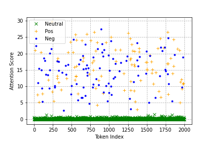
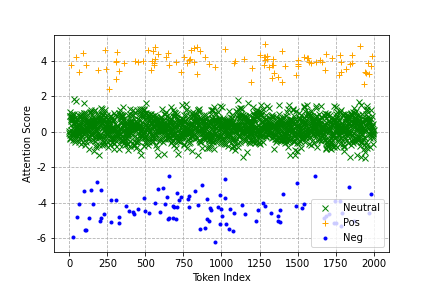

### Rethinking Attention Weights as Bidirectional Coefficients

Python impletement of paper *Rethinking Attention Weights as Bidirectional Coefficients*

#### Introduction

Attention mechanism, as a popular model architecture in deep learning, has a distinctive feature to compute non-negative softmax distribution to re-weight input representations. This work reconsiders attention weights as bidirectional coefficients for potential benefits in interpretability and representational capacity.  After analyzing the iteration process of attention scores through backwards gradient propagation, we proposed a novel activation function TanhMax, which possesses several favorable properties to satisfy the requirements of bidirectional attention. We conduct a battery of experiments to validate our analyses and advantages of proposed method on both text and image datasets. The results show that bidirectional attention is effective in revealing input unit's semantics, presenting more interpretable explanations and increasing the expressive power of attention-based model.

#### Result

We evaluate the effectiveness of proposed architecture, TanhMax, on synthetic data, four real text datasets and two images classification datasets. The detailed experimental setting and numerical results can be found in the paper. 

Below are scatter plots to visualization Softmax and TanhMax coefficients.

#### Reference

We use ViT model as described by paper *An Image is Worth 16x16 Words: Transformers for Image Recognition at Scale* [link](https://github.com/huggingface/pytorch-image-models/blob/main/timm/models/vision_transformer.py) as our backbone on images classification tasks.

We use code in the paper *Attention is not all you need: pure attention loses rank doubly exponentially with depth* [link](https://github.com/twistedcubic/attention-rank-collapse) to examine the representational power of proposed method.
